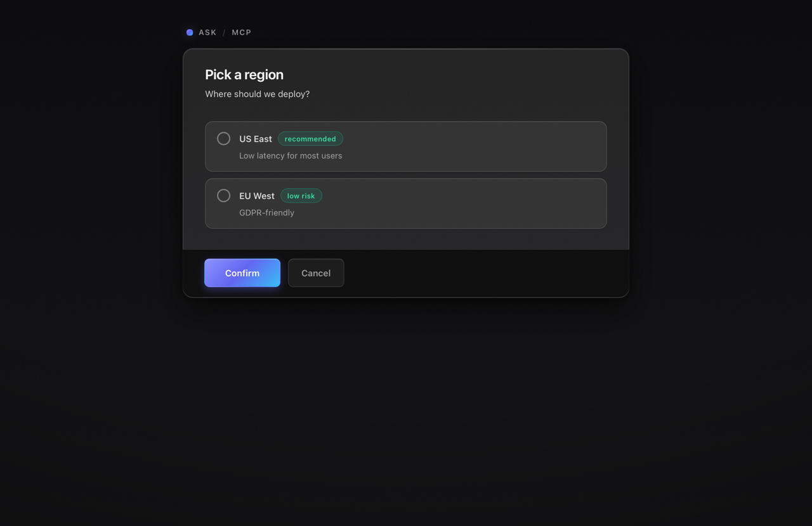
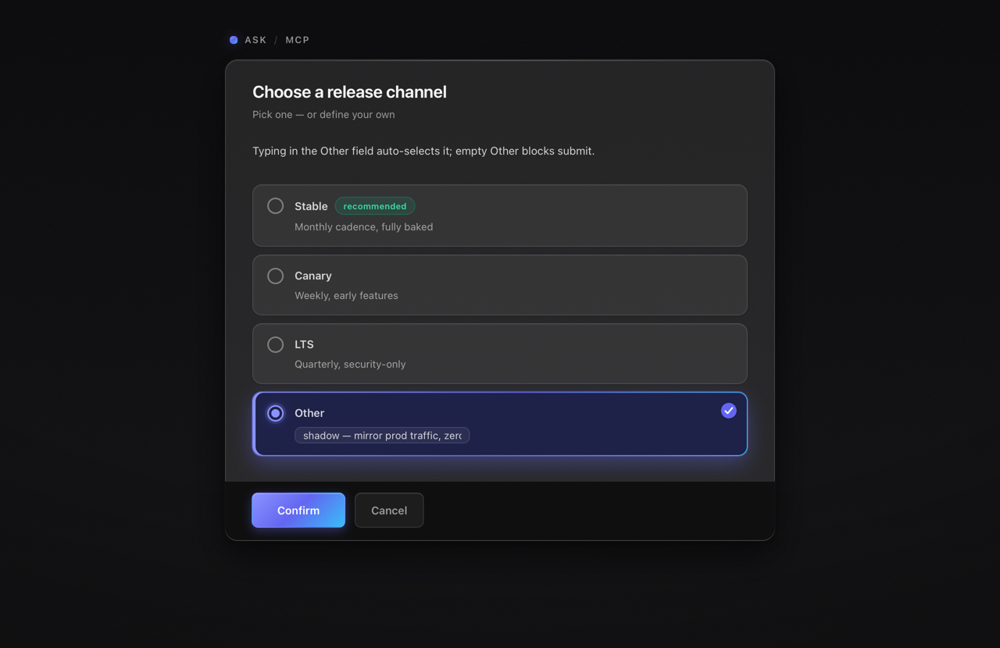
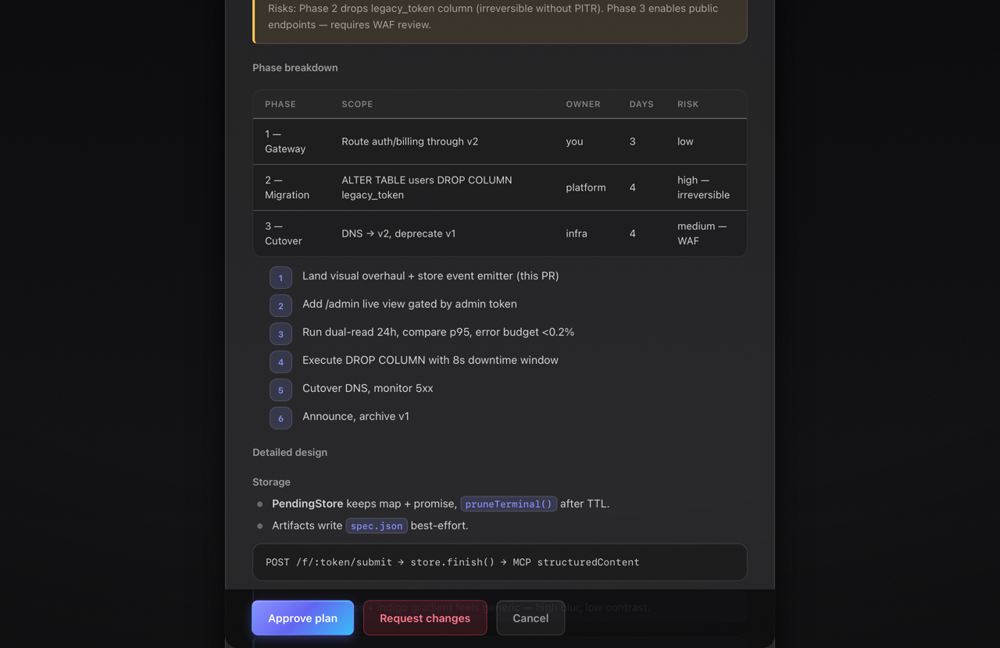
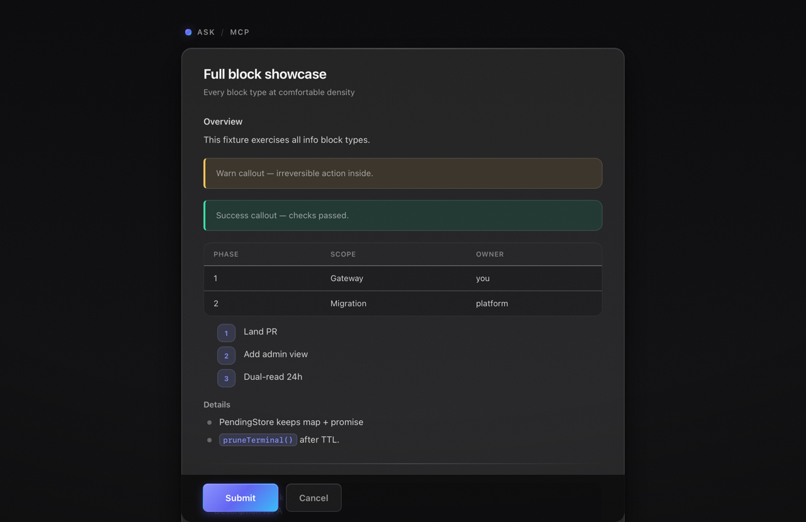

# ask-mcp

[](https://www.npmjs.com/package/@pylotlight/ask-mcp)
[](package.json)
[](package.json)

A blocking **"ask the user"** MCP tool that renders questions as real HTML forms in the browser — approvals, choices, tables, markdown, short forms — and returns structured, validated answers to the agent.

## The problem

Agent harnesses ship basic question tools (opencode's built-in `question`, Claude Code's `AskUserQuestion`). They render as inline chips in the chat and cap out fast:

- **No room for context** — a plan, a diff summary, or a comparison table has to be squeezed into chat text before the question.
- **Loose answers** — free text the model must re-parse and hope it inferred your intent correctly, instead of validated structured data.
- **No audit trail** — once the chat scrolls away, the question, the options you saw, and the answer you gave are gone.
- **No lifecycle** — nothing to review later, no way to see or cancel what's currently pending.

## The solution

`ask` gives every question a proper surface. The agent calls the MCP tool, a form opens in your browser, and the tool call **blocks** until you answer, cancel, or the timeout fires:

```
agent ── tools/call("ask", {...}) ──► ask-mcp ──► renders form + opens browser
                                                     │
agent ◄── structured result ──── submit/cancel/timeout ◄┘
```

**Control** — decide with full context instead of a one-line prompt: option cards, callouts, step lists, tables, required rejection notes, forms with real typed fields and server-side validation.

**Visibility** — every interaction is inspectable: live pending asks you can cancel from an admin panel, a day-partitioned history of every spec and response, archived renders of exactly what you saw, and named templates that turn recurring decisions into reviewable assets.

## Screenshots

| Choice cards | Free-text escape hatch |
| --- | --- |
|  |  |

| Plan approval with action bar | Info blocks |
| --- | --- |
|  |  |

## Install & run

```bash
bunx @pylotlight/ask-mcp              # run without installing
npx -y @pylotlight/ask-mcp            # same, via npm
npm i -g @pylotlight/ask-mcp          # or install globally → `ask-mcp`
```

Requires Node ≥ 22 or Bun ≥ 1.2. There are two ways to connect it to your MCP client — pick one:

### Option A: client-spawned (npx style)

The client launches the package itself, like any other npm MCP server. The tool call blocks, the form opens in your browser, and a small loopback HTTP server serves the form pages (falls back to a free port if 8787 is busy).

**Claude Code:**

```bash
claude mcp add ask -- npx -y @pylotlight/ask-mcp --stdio
```

**opencode** — `~/.config/opencode/opencode.json`:

```json
{
  "mcp": {
    "ask": {
      "type": "local",
      "command": ["npx", "-y", "@pylotlight/ask-mcp", "--stdio"],
      "enabled": true
    }
  },
  "experimental": { "mcp_timeout": 600000 }
}
```

**Claude Desktop** (stdio-only client) — `claude_desktop_config.json`:

```json
{
  "mcpServers": {
    "ask": { "command": "npx", "args": ["-y", "@pylotlight/ask-mcp", "--stdio"] }
  }
}
```

`mcp_timeout` matters: clients default to ~30 s tool timeouts, which kills any blocking ask. Ten minutes is a good starting point; match it with `--timeout-ms` if you want the server and client to agree.

### Option B: shared server

Run the server yourself and point clients at it — one instance shared by multiple clients, and the gateway to the **admin panel**, **history**, and the **`/api/ask`** HTTP twin:

```bash
bunx @pylotlight/ask-mcp              # listens on http://127.0.0.1:8787, forms auto-open
```

**opencode**: `"type": "remote", "url": "http://127.0.0.1:8787/mcp"` (plus `mcp_timeout` as above).
**Claude Code**: `claude mcp add --transport http ask http://127.0.0.1:8787/mcp`.
**Other clients**: anything speaking MCP Streamable HTTP can point at `http://<host>:8787/mcp`; stdio-only clients can bridge with `supergateway`/`mcp-proxy`.

If the port is busy (e.g. ask-mcp is already running), it says so instead of crashing.

## Features

- **Five input kinds** — `approve`, `single_choice`, `multi_choice`, `text`, `form`. The `type` field is optional and inferred from the fields you provide (`multi_choice` is the one exception — set it explicitly).
- **Other escape hatch** — choice prompts accept `other: { placeholder }`, rendering a final pseudo-option with a free-text field: typing auto-selects it, an empty Other blocks submit, and the answer arrives as `otherText`.
- **Info blocks** — headings, paragraphs, markdown (safe subset), callouts, steps, option cards, tables, dividers.
- **Blocking semantics** — the MCP call stays open until the user responds; results come back as `structuredContent` plus a human-readable summary.
- **Templates** — recurring asks saved as named, validated recipes (`deploy-confirm`, your own); the agent discovers them with `ask_templates` and invokes by id.
- **Admin panel** — token-gated dashboard: live pending asks with cancel, full history browser, config editor, template CRUD.
- **Artifacts** — every ask is persisted (`spec.json`, `response.json`, `render.html`) under `~/.config/ask-mcp/YYYY-MM-DD/<token>/`, with optional retention pruning.
- **Live pages** — forms track status over SSE: submitted → delivered, cancelled, expired; the page locks and tries to dismiss itself when done.
- **HTTP twin** — `POST /api/ask` + `GET /api/templates` give scripts and CI the same pipeline as the MCP tool (see [docs/commands.md](docs/commands.md)).
- **Safe by construction** — HTML-escaped rendering, strict zod schemas, per-ask 128-bit capability tokens, strict CSP, loopback-by-default binding.

## The `ask` tool

```jsonc
{
  "title": "Deploy to production?",           // required, ≤ 120 chars
  "subtitle": "12 checks passed",             // optional
  "blocks": [                                 // context shown above the input
    { "type": "markdown", "markdown": "**3 files** changed (+142 −38)" },
    { "type": "option_card", "id": "now", "title": "Deploy now", "meta": "~4 min", "description": "Blue-green, instant rollback" },
    { "type": "option_card", "id": "later", "title": "Wait for Friday", "description": "Lower traffic window" }
  ],
  "input": {                                  // `type` optional — inferred
    "options": [
      { "id": "now", "label": "Deploy now" },
      { "id": "later", "label": "Later" }
    ]
  },
  "options": { "density": "comfortable", "allowCancel": true }  // optional
}
```

### Input inference

| Fields present                      | Resolved type   |
| ----------------------------------- | --------------- |
| `schema`                            | `form`          |
| `options`                           | `single_choice` |
| `placeholder` / `multiline` / `minLength` / `maxLength` / `submitLabel` | `text` |
| anything else (or nothing)          | `approve`       |

Per-kind extras: `approve` accepts `approveLabel`, `rejectLabel`, `noteRequired` (`never|on_reject|always`), `notePlaceholder`; `single_choice`/`multi_choice` accept `other: { placeholder }` and `multi_choice` also `min`/`max`; `text` accepts `placeholder`, `multiline`, `minLength`, `maxLength`, `submitLabel`; `form` takes a JSON-schema-ish object (string/number/integer/boolean fields, `enum`, `format`, bounds, `required`). `blocks` is optional — a title-only approve ask is valid. `multi_choice` is never inferred: pass `type: "multi_choice"` explicitly.

### Results

`structuredContent` depends on the interaction:

```jsonc
{ "action": "choose", "optionId": "now", "note": "optional" }
{ "action": "choose", "optionIds": ["a", "b"] }
{ "action": "choose", "optionId": "__other__", "otherText": "custom answer" }
{ "action": "submit", "value": "free text" }
{ "action": "submit", "values": { "field": "value", "count": 3, "ok": true } }
{ "action": "approve" | "reject" }        // note included when provided
{ "action": "cancel" }                    // user cancelled (nothing was sent)
{ "action": "timeout" }                   // treat the question as unanswered
```

The `content[0].text` is a one-line summary (e.g. `User chose "Deploy now".`), so clients that surface text get a readable answer too. Submissions are re-validated server-side against the original ask before they're accepted.

### Templates

Recurring interactions can be saved as named templates (`~/.config/ask-mcp/templates/<id>.json`, editable in the admin panel) and referenced by id — explicit fields override the template:

```jsonc
{ "template": "deploy-confirm", "title": "Deploy to staging?" }
```

Use the `ask_templates` tool to list what's installed. See [docs/commands.md](docs/commands.md).

## Slash command (opencode / openchamber)

```bash
npx -y @pylotlight/ask-mcp install-commands   # installs /ask-admin
```

`/ask-admin` opens the admin panel (`/admin`) in the browser. All `ask` interactions are agent-driven via the MCP `ask` tool (and `ask_templates` for discovery); the `/api/ask` + `/api/templates` HTTP endpoints are the plain-HTTP twin for scripts. See [docs/commands.md](docs/commands.md).

## Admin panel

Start with `--admin-token <t>` (or `--auth-token`) and open `/admin`:

- **Live asks** — pending queue with one-click cancel, streamed over SSE
- **History** — the day-partitioned artifact trail (spec/response side by side, archived renders)
- **Config** — a form over `~/.config/ask-mcp/config.json` (CLI > env > file precedence; safe fields apply live)
- **Templates** — CRUD for ask recipes, validated with the same pipeline as live asks

Hidden (404) until a token is configured; see [docs/admin.md](docs/admin.md).

## CLI reference

```
ask-mcp [options]
ask-mcp install-commands [--dir <target>] [--force]

  --port <n>           HTTP port (default: 8787)
  --host <addr>        Bind address (default: 127.0.0.1)
  --base-url <url>     Public base URL for form links
  --config <path>      Config file (default: ~/.config/ask-mcp/config.json; CLI > env > file > defaults)
  --data-dir <dir>     Artifact directory (default: ~/.config/ask-mcp)
  --retention-days <n> Prune artifacts older than n days at startup + every 6 h (default: 0 = forever)
  --timeout-ms <n>     Ask blocking timeout (default: 600000, min 1000)
  --surface <mode>     auto | apps | browser (MCP Apps is deferred; see docs/)
  --auth-token <t>     Require Bearer auth on the MCP endpoint
  --admin-token <t>    Unlock the /admin panel (falls back to --auth-token)
  --no-open            Don't auto-open forms in a browser
  --stdio              Serve MCP over stdin/stdout (client-spawned mode); form pages still served over loopback HTTP
  -h, --help           Show help
```

Every flag has an `ASK_MCP_*` env equivalent; persistent settings live in the config file (managed in the admin panel's **Config** tab).

## Authoring guidance for models

- Put alternatives in `option_card` blocks and reference the same ids in choice options — cards become the clickable choices automatically (no duplication).
- `approve` is for a single recommended plan; a rejection reason flows through `note` (require it with `noteRequired`).
- Use `form`/`text` to collect data, choices to pick between plans.
- One primary input per ask; ask follow-ups in subsequent calls.
- Keep blocks concise — this is a decision surface, not a report.

## Security model

- Binds to loopback by default; set `--host 0.0.0.0` only with `--auth-token`.
- The MCP endpoint accepts optional Bearer auth (constant-time compare). Form pages rely on their unguessable 128-bit per-ask token as a capability URL — that's what makes browser auto-open work without headers.
- Pages ship a strict CSP (`default-src 'none'`, no framing), `no-referrer`, and every string is escaped before rendering; markdown is sanitized by whitelist, never passed through.
- Form POSTs are re-validated against the ask's schema; cancel/submit are single-shot state transitions.

## Development

```bash
git clone https://github.com/PylotLight/ask-mcp && cd ask-mcp
bun install
bun run build        # tsc emit → dist/
bun run typecheck    # tsc --noEmit
bun run test         # vitest
bun src/index.ts     # run from source (or: node dist/index.js)
```

Source layout:

```
src/
  index.ts            entrypoint: config, stores, http server, signals (--stdio adds the stdio MCP transport)
  config.ts           CLI/env/config-file parsing + validation (--help has the full list)
  commands/           install-commands (opencode/openchamber slash command installer)
  schema/             zod: blocks, input spec (+ lenient inference), args, results
  server/             http routes, mcp endpoint, admin panel routes, /api/ask, shared ask flow
  store/              pending asks (in-memory, TTL/pruning), artifact persistence, templates
  render/             page/styles/client script/blocks/markdown/escaping + admin dashboard UI
  util/               tokens, open-in-browser
```

Artifacts land in `--data-dir` (default `~/.config/ask-mcp`) as `YYYY-MM-DD/<token>/{spec.json,response.json,render.html}` — a full audit trail of every question asked, shown, and answered.

## Roadmap

The admin panel (live ask monitor, history, config, templates) and the `/ask-admin` slash command are implemented — see [docs/admin.md](docs/admin.md) and [docs/commands.md](docs/commands.md). The broader exploration (re-asks, webhooks, richer interaction blocks) lives in [docs/admin-roadmap.md](docs/admin-roadmap.md). MCP Apps (rendering the ask inside the MCP client itself) is designed but intentionally deferred — see [docs/surface-a-mcp-apps.md](docs/surface-a-mcp-apps.md).
